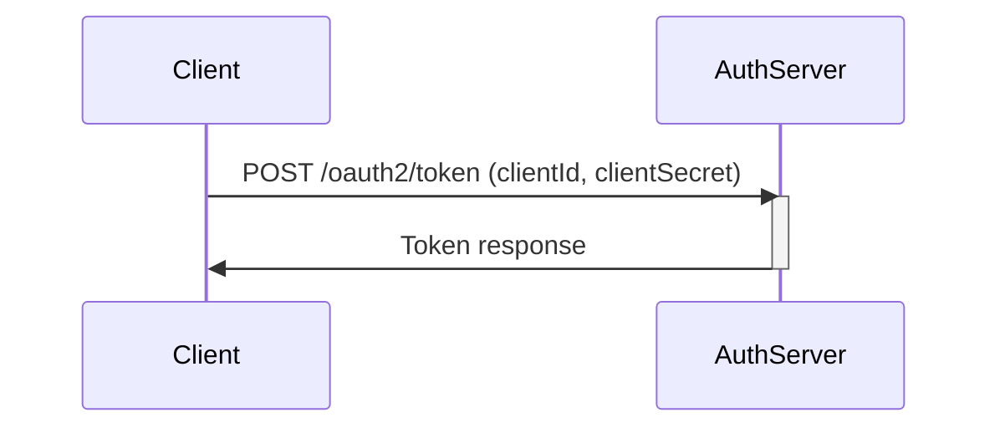

# Authenticating
Contact [kontakt@sikt.no](mailto:kontakt@sikt.no?subject=Tilgang%20til%20NVA%20API) to request
access the NVA API on behalf of your institution. When this is established, you should get a
`clientId` and `clientSecret` in return. This will be used to obtain an access token that is used
when accessing the API.

Authentication servers:
* Test: nva-test.auth.eu-west-1.amazoncognito.com
* Production: nva-prod.auth.eu-west-1.amazoncognito.com

## Obtaining an access token

You can exchange your `clientId` and `clientSecret` for an access token using the following request
using Basic Authorization with `clientId` as the username and `clientSecret` as the password:
```http request
POST /oauth2/token HTTP/1.1
Host: <authentication server>
Content-Type: application/x-www-form-urlencoded
Authorization: Basic <base64urlencode(clientId + ':' + clientSecret)>

grant_type=client_credentials
```

In return, you will get a response like this:
```json
{
  "access_token": "<your access token>",
  "expires_in": 900,
  "token_type": "Bearer"
}
```

The access token above is valid for 900 seconds, after which you will have to get a new token to
keep accessing the API.

Using this token in subsequent requests to the API is done by providing the following request
header:
```
Authorization: Bearer <your access token>
```