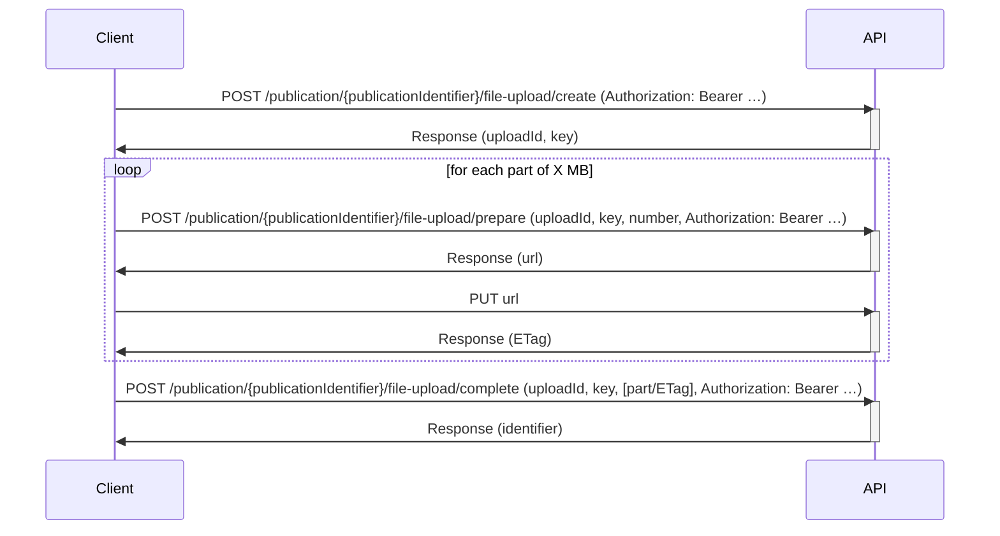

# File upload in the NVA API
Note that for large files, you will need to split the file in parts, and iterate over *Prepare part* and *Upload part* as described below.


## Initiate file upload
[Swagger documentation](https://swagger-ui.nva.unit.no/#/publication/{publicationIdentifier}/file-upload/create)

```http request
POST /publication/{publicationIdentifier}/file-upload/create HTTP/1.1
Host: api.test.nva.aws.unit.no
Content-Type: application/json
Authorization: Bearer ***

{
    "filename": "my-thesis.pdf",
    "size": 2812876,
    "lastmodified": 1698846480,
    "mimetype": "application/pdf",
    "md5hash": "3b1dc6d3b5365ebe8db5bd6c3861d8cd"
}
```
The response will look like this:
```json
{
    "uploadId": "<uploadId>",
    "key": "<key>"
}
```

## Prepare part(s)
[Swagger documentation](https://swagger-ui.nva.unit.no/#/publication/{publicationIdentifier}/file-upload/prepare)

```http request
POST /publication/{publicationIdentifier}/file-upload/prepare HTTP/1.1
Host: api.test.nva.aws.unit.no
Content-Type: application/json
Authorization: Bearer ***

{
    "number": 1,
    "uploadId": "<from response from create upload>",
    "key": "<from response from create upload>"
}
```

The response will look like this:
```json
{
  "url": "<presignedUrl>"
}
```

## Upload part
Now you can upload part to the presigned url received from *Prepare part(s)*. The value of the *Content-Type* header should match whatever file type you are trying to upload.
```http request
PUT /<path from response presignedUrl from prepare part>
Host: <host from response presignedUrl from prepare part>
Content-Type: application/pdf

"<file contents here>"
```
You will get 200 OK with an empty body.

## Complete upload
[Swagger documentation](https://swagger-ui.nva.unit.no/#/publication/{publicationIdentifier}/file-upload/complete)

```http request
POST /publication/{publicationIdentifier}/file-upload/complete HTTP/1.1
Host: api.test.nva.aws.unit.no
Content-Type: application/json
Authorization: Bearer ***

{
    "parts": [{
        "partNumber": 1,
        "ETag": "<ETag from upload part response>"
    }],
    "uploadId": "<from response from create upload>",
    "key": "<from response from create upload>"
}
```

The response will look like this:
```json
{
    "location": "<location>",
    "identifier": "<identifier>",
    "fileName": "my-thesis.pdf",
    "mimeType": "application/pdf",
    "size": 2812876
}
```
The identifier can be used to reference the uploaded file from a publication in `associatedArtifacts` when uploading the metadata [here](https://swagger-ui.nva.unit.no/#/NVA%20Publication%20API/post_publication_)
